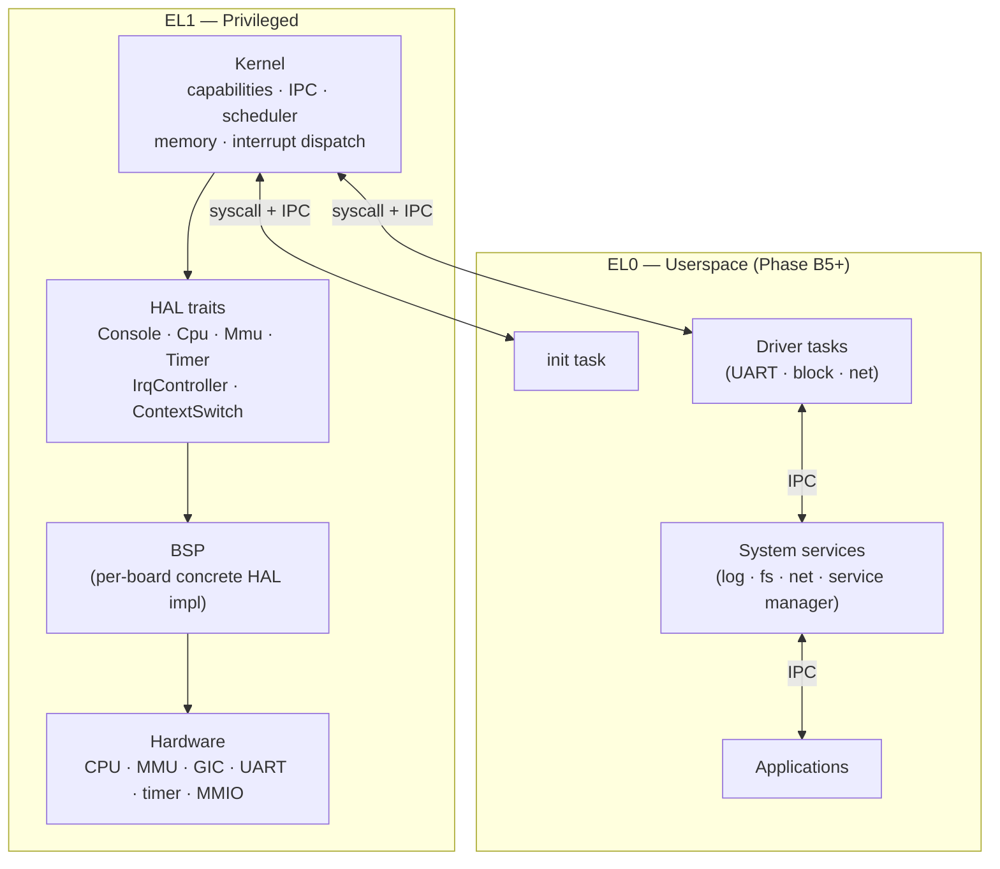

# Tyrne

> A capability-based microkernel written in Rust, designed to scale from constrained smart-home devices to mobile-class hardware while never compromising on isolation or authority discipline.

Tyrne is built around a single idea: **no ambient authority**. Every action a component takes is authorised by a capability it was explicitly granted, and the kernel is small enough that the entire trusted computing base can be audited line by line. Drivers, filesystems, and network stacks live in userspace; the kernel concerns itself only with capabilities, IPC, scheduling, memory, and interrupt dispatch.

The project is pre-alpha. The kernel boots end-to-end on QEMU `virt` aarch64 today, runs a capability-gated IPC demo, and is mid-way through the Phase B work that lifts it from a single privileged address space into per-task userspace.

---

## Status at a glance

| Area | State |
|------|-------|
| Boot, console, scheduler | **Done** — kernel reaches steady state on QEMU `virt` aarch64; two cooperative tasks run an end-to-end IPC round-trip. |
| Capability tables + IPC | **Done** — `cap_copy` / `cap_derive` / `cap_revoke` / `cap_drop`; synchronous send/recv with rollback-on-deadlock. |
| Exception infrastructure + GIC v2 | **Done** — 16-entry vector table at `VBAR_EL1`; generic-timer IRQ wiring; idle `wfi` activation. |
| MMU activation + page-table walker | **Done** — identity-mapped `TTBR0_EL1` with typed `MapperFlush` discipline. |
| Physical Memory Manager | **Done** — bitmap allocator with zero-fill on `alloc_frame` and three-stage validation on `free_frame`. |
| Per-task `AddressSpace` kernel object | **Done** — cap-gated `cap_create_address_space` / `cap_map` / `cap_unmap`. |
| Task loader (load half) | **Done** — `load_image` produces a `LoadedImage` describing a populated address space for a `.rodata`-resident raw-flat blob. |
| Syscall ABI + EL0 entry | **Next** — Phase B5; will turn `LoadedImage` into a runnable `Task`. |
| First userspace "hello" | **Planned** — Phase B6. |

The active task and its current state live in [`docs/roadmap/current.md`](docs/roadmap/current.md). Full phase plans are under [`docs/roadmap/phases/`](docs/roadmap/phases/).

---

## What makes Tyrne different

**Capability discipline, end to end.** Every privileged operation requires the caller to hold a capability that names it. Capabilities are unforgeable kernel-held tokens with explicit derivation trees; revoking a parent cascades to its children. There is no equivalent of a UNIX root, an admin override, or an ambient `CAP_SYS_ADMIN`. The discipline is documented in [ADR-0014](docs/decisions/0014-capability-representation.md) and surfaces in every wrapper — `cap_map(cap, …)`, `cap_create_address_space(parent_cap, …)`, etc.

**Microkernel by construction, not by branding.** The kernel runs exclusively in privileged mode and contains five subsystems: capabilities, IPC, scheduling, memory management, and interrupt dispatch. Drivers, filesystems, and network stacks land in userspace compartments — see [`docs/architecture/overview.md`](docs/architecture/overview.md) for the layer diagram. Adding a feature does not enlarge the trusted computing base unless it strictly has to.

**Memory safety through Rust + audited `unsafe`.** All kernel, HAL, and userspace code is Rust. Every `unsafe` block carries a SAFETY comment explaining (a) why it is needed, (b) the invariants it upholds, and (c) why safer alternatives were rejected, and is tracked in [`docs/audits/unsafe-log.md`](docs/audits/unsafe-log.md) with a numbered ID, a reviewed-by line, and a status field. There are currently 27 `unsafe` audit entries; the kernel proper exposes one (`UNSAFE-2026-0027`, the task-loader byte-copy).

**HAL separation as a hard architectural rule.** Hardware-specific code lives behind a small set of traits — `Console`, `Cpu`, `Mmu`, `Timer`, `IrqController`, `ContextSwitch` — defined in the `tyrne-hal` crate. Each Board Support Package implements those traits for one board. Bringing up a new aarch64 SoC means writing a new BSP, not editing the kernel.

**Heterogeneous hardware as a stated goal.** The same kernel is intended to scale from microcontroller-class smart-home devices to single-board computers and eventually to mobile-class SoCs. Hardware tiers (below) make the level of support explicit per target.

**Documented decisions, append-only.** Every non-trivial architectural choice is captured as an Architecture Decision Record under [`docs/decisions/`](docs/decisions/). ADRs are append-only: corrections land as revision notes, supersessions write a new ADR. The current count is 32 accepted ADRs.

---

## Quick start

The primary development target is QEMU's `virt` machine. Boot the kernel end-to-end with two commands:

```sh
# 1. Build the kernel image (aarch64-unknown-none target).
cargo kernel-build

# 2. Run it under QEMU; serial is multiplexed onto your terminal.
cargo kernel-run
```

You should see, in order:

```text
tyrne: hello from kernel_main
tyrne: mmu activated
tyrne: pmm initialized (32599 frames available; 169 reserved)
tyrne: address-space-arena ready (1 / 8 slots used; bootstrap AS root = 0x40095000)
tyrne: image loaded (entry = 0x800000; sp = 0x802000; image bytes 8; stack bytes 4096; AS cap = idx 1)
tyrne: timer ready (62500000 Hz, resolution 16 ns)
tyrne: starting cooperative scheduler
tyrne: task B — waiting for IPC
tyrne: task A -- sending IPC
tyrne: task B — received IPC (label=0xaaaa); replying
tyrne: task A — received reply (label=0xbbbb); done
tyrne: all tasks complete
tyrne: boot-to-end elapsed = ... ns
```

Exit QEMU with `Ctrl-A x`. Full prerequisites, troubleshooting, and a line-by-line trace breakdown live in [`docs/guides/run-under-qemu.md`](docs/guides/run-under-qemu.md).

**Host-side tests** (no QEMU required):

```sh
cargo host-test          # 259 tests across kernel, HAL, test-HAL
cargo host-clippy        # -D warnings
cargo kernel-clippy      # -D warnings (kernel crate's stricter lints)
cargo fmt --check
```

---

## Architecture at a glance

Three layers. The kernel runs at EL1; userspace will run at EL0 once the syscall ABI lands.



The kernel sees only the HAL trait surface. The BSP supplies the concrete implementations (`QemuVirtMmu`, `Pl011Uart`, `QemuVirtGic`, etc.). Hardware-specific assembly — the reset vector, the EL2→EL1 drop, the exception trampolines — lives in the BSP, never in the portable kernel crate.

For a deeper read, start with [`docs/architecture/overview.md`](docs/architecture/overview.md) and follow its cross-links.

---

## Hardware tiers

Tiers describe the level of support committed to a target, not the quality of that target.

| Tier | Target | Role |
|------|--------|------|
| 1 — primary dev | QEMU `virt`, aarch64 | First bring-up target; CI runs here |
| 2 — first real hardware | Raspberry Pi 4 (BCM2711, Cortex-A72) | First port off emulation |
| 2 | Raspberry Pi 5 (BCM2712, Cortex-A76) | Follow-on after Pi 4 |
| 3 | NVIDIA Jetson Nano / Orin (aarch64 CPU only) | Exploratory — see Jetson caveat below |
| 3 | RISC-V embedded SoCs (e.g. ESP32-C3/C6, SiFive) | Roadmap — smart-home class |
| 4 | Mobile-class aarch64 SoCs | Long-term vision |

**Jetson caveat.** Jetson devices are aarch64, so their CPU side is portable. Their GPU and Tensor cores require proprietary NVIDIA userspace blobs with no open-source driver. Tyrne rejects proprietary kernel-adjacent blobs on principle, so Jetson will be supported only as a plain aarch64 board; on-device AI acceleration on Jetson is explicitly out of scope. Projects that need open NPU acceleration should target Rockchip NPUs, Hailo, or Google Coral instead. See [ADR-0004](docs/decisions/0004-target-platforms.md).

**No proprietary blobs** is a non-negotiable design rule for everything that touches the kernel or its image. It is one of seven rules listed at the top of [`CLAUDE.md`](CLAUDE.md).

---

## Repository layout

```
.
├── kernel/             tyrne-kernel — capability tables, IPC, scheduler,
│                       memory management, kernel objects (Task, Endpoint,
│                       Notification, AddressSpace), task loader.
├── hal/                tyrne-hal — portable trait surface:
│                       Console, Cpu, ContextSwitch, Mmu, Timer, IrqController,
│                       plus pure encoder helpers (VMSAv8 page-table format,
│                       timer tick arithmetic).
├── test-hal/           tyrne-test-hal — in-tree FakeMmu, VecFrameProvider,
│                       FakeCpu, etc. Host-test only; never linked into
│                       a kernel image.
├── bsp-qemu-virt/      tyrne-bsp-qemu-virt — primary dev BSP:
│                       boot.s + vectors.s, EL2→EL1 drop, MMU bootstrap,
│                       PL011 UART driver, GIC v2 driver, kernel_entry
│                       wiring up every subsystem in order.
├── tools/              Developer helpers (run-qemu.sh, perf harness, etc.).
├── docs/
│   ├── architecture/   System design chapters (overview · boot · scheduler
│   │                   · IPC · HAL · memory-management · task-loader
│   │                   · exceptions · security-model).
│   ├── decisions/      Architecture Decision Records (MADR-style, append-only).
│   ├── guides/         How-to guides (run-under-qemu, two-task-demo, ci).
│   ├── standards/      Coding, documentation, review, and security standards.
│   ├── audits/         unsafe-log.md — every audited unsafe block.
│   ├── analysis/       Per-task user stories, business / security /
│   │                   performance reviews, and reports.
│   ├── roadmap/        Phase plans + current focus.
│   └── glossary.md
├── .agents/            Procedure library shared by all AI agents that
│                       work in this repo (skills/<slug>/SKILL.md format).
├── CLAUDE.md           Entry point for Claude-based agents.
├── AGENTS.md           Entry point for all AI agents.
├── CONTRIBUTING.md
├── SECURITY.md
├── LICENSE             Apache-2.0.
└── NOTICE
```

Four Rust crates, one Cargo workspace. The split is pinned in [ADR-0006](docs/decisions/0006-workspace-layout.md).

---

## Documentation map

The repo is documentation-first. Three reading orders depending on what you need.

**Reader who wants the design.** Start at [`docs/architecture/overview.md`](docs/architecture/overview.md), then follow its cross-links to the chapter on the subsystem you care about ([boot](docs/architecture/boot.md), [scheduler](docs/architecture/scheduler.md), [IPC](docs/architecture/ipc.md), [memory-management](docs/architecture/memory-management.md), [task-loader](docs/architecture/task-loader.md), [HAL](docs/architecture/hal.md), [exceptions](docs/architecture/exceptions.md), [security-model](docs/architecture/security-model.md)). Each chapter cites the ADRs it synthesises; the ADR is authoritative when they disagree.

**Reader who wants the *why*.** Read [`docs/decisions/`](docs/decisions/) in numeric order. The first dozen ADRs establish the project's design language; the rest apply that language to specific subsystems. The index in [`docs/decisions/README.md`](docs/decisions/README.md) lists every ADR with title, status, and date.

**Reader who wants to do something concrete.**
- [`docs/guides/run-under-qemu.md`](docs/guides/run-under-qemu.md) — boot the kernel under QEMU.
- [`docs/guides/two-task-demo.md`](docs/guides/two-task-demo.md) — annotated trace of the IPC demo.
- [`docs/guides/ci.md`](docs/guides/ci.md) — what the CI pipeline runs and why.
- [`docs/standards/`](docs/standards/) — coding, documentation, review, and security disciplines that every change is held to.
- [`docs/glossary.md`](docs/glossary.md) — project-specific terminology.

**Reader who wants to track progress.** [`docs/roadmap/current.md`](docs/roadmap/current.md) is the single source of truth for what is active right now, what just closed, and what is next. Full phase plans live alongside it in [`docs/roadmap/phases/`](docs/roadmap/phases/).

---

## Engineering disciplines

A short, opinionated list of the rules every change is held to. The long-form list is in [`CLAUDE.md`](CLAUDE.md) and the standards under [`docs/standards/`](docs/standards/).

- **Security-first.** When in doubt, choose the more conservative option. Never weaken a capability check, never introduce ambient authority, never suppress a failing security test.
- **Audited `unsafe`.** Every `unsafe` block has an audit-log entry with an Operation / Invariants / Rejected-alternatives section, a reviewer line, and a status field. The kernel crate denies `clippy::panic`, `clippy::unwrap_used`, `clippy::expect_used`, and `clippy::arithmetic_side_effects`.
- **ADR-first for non-trivial decisions.** No "we'll write it down later". Significant architectural / security / process decisions land as an ADR before the code that implements them.
- **English in the repository.** Source, comments, doc-comments, commit messages, PR descriptions, issue text — all English.
- **Mermaid for diagrams.** No PNG / SVG / ASCII-art for architectural illustrations.
- **No proprietary blobs in the kernel image.** Stated rule, not aspirational.
- **Methodical, phased progress.** Non-trivial work is proposed as a phase plan, executed one phase at a time, and reviewed between phases. The pre-alpha pace is deliberate.

---

## Contributing

Tyrne is in early bring-up. External code contributions are not yet being accepted while the foundational documents and the kernel's core surface are still being written; accepting code PRs too early would fragment the design. Issues, references, prior-art suggestions, and review of the published ADRs are very welcome. See [`CONTRIBUTING.md`](CONTRIBUTING.md) for the current contribution channels.

If you have a security-relevant observation, follow the disclosure process in [`SECURITY.md`](SECURITY.md).

---

## Naming

*Tyrne* is a clean-slate invented identifier — no etymology, no guardian / shadow / perimeter motif, no shared trademark surface. The name was selected in April 2026 after the project's previous working name (Umbrix) was retired for a registry conflict; the rename is recorded in the project's git history but is otherwise unremarkable. Use *Tyrne* in writing; the verbal form rhymes with *Berne*.

---

## License

Tyrne is licensed under the [Apache License, Version 2.0](LICENSE). Attribution requirements are in [`NOTICE`](NOTICE). Contributions are accepted under the same license under the inbound-equals-outbound rule.
