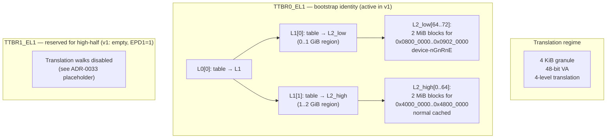

# Memory management

This document covers the kernel's virtual memory architecture: how the MMU is activated, what the v1 layout looks like, how page-table entries encode permissions and memory types, and how mapping mutations enforce TLB-invalidation discipline through the type system.

It synthesises [ADR-0009](../decisions/0009-mmu-trait.md) (the `Mmu` HAL trait), [ADR-0012](../decisions/0012-boot-flow-qemu-virt.md) §Memory layout (the static image layout), and [ADR-0027](../decisions/0027-kernel-virtual-memory-layout.md) (the B2 MMU activation decision). When the document and an ADR disagree, the ADR is authoritative — this doc is a synthesis, not a substitute.

## Why a memory-management chapter

The MMU is the architectural surface where capability semantics meet hardware. A `MemoryRegionCap` grant becomes a sequence of [`Mmu::map`](../../hal/src/mmu.rs) calls; a revocation becomes [`Mmu::unmap`](../../hal/src/mmu.rs) plus a TLB invalidation; a page fault from userspace becomes a synchronous exception that the capability system routes back to the offending task. None of that is reachable while translation is off, which is why B2's first commitment is to turn the MMU on.

Activating the MMU is also the project's first architectural state-machine transition that *cannot fail gracefully on the first instruction after the flip*: a typo in any of the page-table entries, the `MAIR_EL1` encoding, the `TCR_EL1` configuration, or the `SCTLR_EL1` write produces a translation fault on the very next instruction-fetch. The simulation table in [ADR-0027 §Decision outcome / §Simulation](../decisions/0027-kernel-virtual-memory-layout.md#simulation) walks the worst-case interaction step-by-step — read it before changing anything in `bsp-qemu-virt/src/mmu.rs` or `bsp-qemu-virt/linker.ld`.

## v1 layout (B2 — identity-only, kernel in `TTBR0_EL1`)

The B2 milestone activates the MMU with a deliberately minimal layout: identity-mapped kernel image and MMIO ranges, `TTBR0_EL1` carrying every translation, `TTBR1_EL1` reserved for the future high-half migration. No userspace, no per-task `TTBR0` swap, no ASID assignment. Everything works at the same address it did before the MMU came on; the MMU is "on" structurally (caching active, attributes enforced) without changing any virtual address the kernel observes.



The four bootstrap page-table frames live in a dedicated `.boot_pt` section in [`bsp-qemu-virt/linker.ld`](../../bsp-qemu-virt/linker.ld) (added by T-016). Each is `PAGE_SIZE`-aligned and pre-zeroed by the existing BSS-zero loop in [`boot.s`](../../bsp-qemu-virt/src/boot.s) because `.boot_pt` is bracketed by `__bss_start` / `__bss_end`. The total budget is **16 KiB of static reservation** (4 frames × 4 KiB). No kernel allocator dependency at the bootstrap moment; all of `.boot_pt` is filled in before `SCTLR_EL1.M = 1`.

### Identity ranges

| Region | PA range | VA range (identity) | Memory type | Permissions | Block-descriptor count |
|--------|----------|---------------------|-------------|-------------|-----------------------|
| GIC distributor / GIC CPU interface | `0x0800_0000 .. 0x0900_0000` | identical | device-nGnRnE (MAIR idx 0) | kernel R/W; UXN, PXN | 8 (each 2 MiB block) |
| PL011 UART | `0x0900_0000 .. 0x0902_0000` | identical | device-nGnRnE (MAIR idx 0) | kernel R/W; UXN, PXN | 1 (one 2 MiB block; UART is sub-block but block-mapped for simplicity) |
| Kernel + RAM | `0x4000_0000 .. 0x4800_0000` | identical | normal cached, write-back, write-allocate, inner shareable (MAIR idx 1) | kernel R/W/X (block-level; finer-grained `.text` RX vs `.rodata` R vs `.bss/.data` RW awaits B3+ remap-to-4-KiB-pages work) | 64 (each 2 MiB block) |

**Why 2 MiB blocks instead of 4 KiB pages?** [ADR-0009](../decisions/0009-mmu-trait.md) commits the `Mmu` trait surface to 4 KiB granularity, but the *bootstrap* page-table construction is BSP-internal: the BSP can use any VMSAv8 feature that makes sense for the boot moment. Identity-mapping 128 MiB of RAM with 4 KiB pages would require ~32 768 L3 entries (64 L3 frames; 256 KiB just for the bootstrap tables) — disproportionate for a step that only needs to identity-cover a contiguous range. 2 MiB block descriptors at L2 reduce the entire bootstrap to 4 page-table frames at the cost of giving up sub-2-MiB granularity until post-MMU code remaps a region into 4 KiB pages. In v1 no caller exercises the sub-2-MiB case (the kernel's `.text` / `.rodata` / `.bss` distinction is enforced by the linker-script + access patterns, not by per-page MMU permissions yet). When B3+ code wants finer-grained permissions on a sub-2-MiB region, the BSP's `Mmu::map` implementation will split the block into 512 4 KiB pages — out of scope for T-016, in scope for the first follow-up B3+ task that needs it.

### `MAIR_EL1` attribute encoding

MAIR carries up to eight 8-bit attribute encodings. v1 commits to two indices and reserves the rest:

| Index | Encoding (`Attr_n`) | Memory type | Used for |
|-------|---------------------|-------------|----------|
| 0 | `0x00` | device-nGnRnE | GIC + UART (every `MappingFlags::DEVICE` mapping) |
| 1 | `0xFF` | normal, inner+outer write-back, write-allocate, read-allocate | RAM (every `!DEVICE` mapping) |
| 2 | reserved (`0x00`) | — | future write-combining or device-GRE |
| 3 | reserved (`0x00`) | — | future normal-uncached for DMA buffers |
| 4–7 | reserved (`0x00`) | — | future memory types (extended via a follow-on MMU ADR) |

The BSP's `QemuVirtMmu::map` implementation translates `MappingFlags::DEVICE → AttrIndx=0` and `!DEVICE → AttrIndx=1` in the page-table entry. When future ADR work introduces a richer `MemoryType` enum, the encoder grows additional discriminant arms — additive change, no impact on existing entries.

### `TCR_EL1` configuration

v1's `TCR_EL1` value commits to the layout shape:

| Field | Bit range | Value | Meaning |
|-------|-----------|-------|---------|
| `T0SZ` | bits 5:0 | 16 | 48-bit `TTBR0_EL1` virtual addresses (`64 - 16 = 48` bits of VA) |
| `EPD0` | bit 7 | 0 | Translations enabled for `TTBR0_EL1` |
| `IRGN0` / `ORGN0` | bits 9:8 / 11:10 | 0b01 / 0b01 | Inner/outer write-back write-allocate cacheable for page-table walks |
| `SH0` | bits 13:12 | 0b11 | Inner shareable for `TTBR0_EL1` walks |
| `TG0` | bits 15:14 | 0b00 | 4 KiB granule for `TTBR0_EL1` |
| `T1SZ` | bits 21:16 | 16 | (reserved; matches T0SZ for symmetry) |
| `EPD1` | bit 23 | **1** | Translations **disabled** for `TTBR1_EL1` (v1 has nothing to map there yet) |
| `IRGN1` / `ORGN1` / `SH1` | bits 25:24 / 27:26 / 29:28 | (reserved; matches TTBR0 settings) | (inert while EPD1=1) |
| `TG1` | bits 31:30 | 0b10 | 4 KiB granule for `TTBR1_EL1` (inert in v1; correct for the future high-half ADR-0033) |
| `IPS` | bits 34:32 | 0b010 | 40-bit Intermediate Physical Address — matches QEMU virt + Cortex-A72 |
| `AS` | bit 36 | 0 | 8-bit ASID field; v1 uses ASID=0 globally |

The [ADR-0033 placeholder] (the future high-half ADR) flips `EPD1=1 → 0` and populates `TTBR1_EL1` when B5 needs per-task `TTBR0_EL1` swap; the rest of `TCR_EL1` stays byte-stable across that transition because the v1 settings already commit to the high-half-friendly shape.

### Page-table entry encoding (block descriptor at L2)

Each L2 block descriptor has the shape (per ARM ARM §D5.3, AArch64 stage-1 block descriptor at level 2 with 4 KiB granule):

```text
bit  63   54 53 52      48 47                21 20      12 11 10 9 8 7 6 5 4 3 2 1 0
    |UXN|PXN| Contig | Res |OutputAddress[47:21]| Reserved |nG|AF|SH| AP|NS|AttrIdx|T|V|
    |   |   |        |     |   (2 MiB-aligned)  |   (RES0) |  |  |   |   |  |       | | |
```

(For L3 page descriptors and level-1 block descriptors the `OutputAddress` field shifts: pages at L3 use bits [47:12] for 4 KiB-aligned PA; blocks at L1 use bits [47:30] for 1 GiB-aligned PA. The table below describes the L2 block-descriptor case used by v1's bootstrap.)

| Field | Bits | v1 value | Meaning |
|-------|------|----------|---------|
| `V` (Valid) | 0 | 1 | Entry is valid; an invalid entry produces a translation fault |
| `T` (Type / Block-vs-Table) | 1 | 0 (block at L2; 1 at L0/L1 = table descriptor) | Distinguishes block descriptor from table descriptor |
| `AttrIndx` | 4:2 | 0 (device) / 1 (normal) | Index into `MAIR_EL1` |
| `NS` (Non-Secure) | 5 | 0 | EL1 secure-state mappings (Tyrne does not currently use TrustZone) |
| `AP` (Access Permissions) | 7:6 | 0b00 (kernel R/W) | `0b00` = kernel R/W, no userspace; `0b01` = kernel R/W + user R/W; `0b10` = kernel R/O, no user; `0b11` = kernel R/O + user R/O |
| `SH` (Shareability) | 9:8 | 0b11 (inner shareable for RAM) / 0b00 (non-shareable for device) | RAM mappings inner-shareable; device mappings non-shareable |
| `AF` (Access Flag) | 10 | 1 | Access flag managed by software in v1; setting AF=1 at map time avoids the AF-fault path |
| `nG` (Not Global) | 11 | 0 (global) | All v1 mappings global; per-ASID lifecycle deferred to ADR-0033 |
| `OutputAddress` | 47:21 (block) / 47:12 (page) | identity (`PA[47:21] = VA[47:21]`) | Physical-address output of the translation |
| `UXN` (Unprivileged eXecute Never) | 54 | 1 | Userspace cannot execute (no userspace yet, but locked-shut-by-default is the right discipline) |
| `PXN` (Privileged eXecute Never) | 53 | 0 for kernel-image RAM; 1 for MMIO | Kernel can execute the kernel image; cannot execute MMIO |

The BSP's [`QemuVirtMmu::map`](../../bsp-qemu-virt/src/mmu.rs) implementation computes the descriptor from `(va, pa, flags)` per the table above. Host tests in `bsp-qemu-virt/src/mmu.rs::tests` pin the encoding for each `MappingFlags` permutation so future BSP edits cannot silently drift the encoding away from the documented contract.

## The `MapperFlush` flush-token discipline

[ADR-0027 §Decision outcome / (c)](../decisions/0027-kernel-virtual-memory-layout.md) extends the [ADR-0009](../decisions/0009-mmu-trait.md) `Mmu` trait so that `map` and `unmap` return a typed `MapperFlush` token instead of `Result<(), MmuError>`. The token carries the just-mapped (or just-unmapped) `VirtAddr` and is `#[must_use]`-decorated so any caller that drops it without explicitly handling it produces a `unused_must_use` lint failure (promoted to a deny in the kernel crate).

Two ways to discharge the token:

```rust
// Pattern 1 — single-mutation call site: flush immediately.
let flush = mmu.map(&mut as_, va, pa, flags, &mut frames)?;
flush.flush(&mmu);  // executes mmu.invalidate_tlb_address(va)

// Pattern 2 — bulk operation: ignore each per-call token, then issue
// a single invalidate_tlb_all() afterwards.
for region in regions {
    let flush = mmu.map(&mut as_, region.va, region.pa, region.flags, &mut frames)?;
    flush.ignore();  // documented no-op; the bulk invalidate follows
}
mmu.invalidate_tlb_all();
```

Forgetting both `.flush()` and `.ignore()` is a compile error. This is the type-system-side encoding of the discipline the [2026-05-07 B1 closure retro §"What we learned"](../analysis/reviews/business-reviews/2026-05-07-B1-closure.md) codified into the [`write-adr` skill](../../.claude/skills/write-adr/SKILL.md) §Simulation rule: when reviewer attention is the only thing standing between a class of bug and shipping, prefer to encode the discipline in the type system.

The token does not carry a `&Mmu` reference (which would require a lifetime parameter and complicate the return signature); the caller passes the `Mmu` reference at `.flush()` time. Mirrors the `x86_64` crate's `MapperFlush` shape — Rust ecosystem prior art for the same problem.

### Why two methods (`flush` and `ignore`) instead of just `flush`?

`Mmu::invalidate_tlb_address(va)` is a per-page TLB invalidate; `Mmu::invalidate_tlb_all()` is a sweep. For bulk operations where N consecutive `map` calls will be followed by a single `invalidate_tlb_all`, calling `.flush()` N times is *correct* but does N redundant per-page invalidates plus the sweep. `.ignore()` exists to make "I know what I'm doing; the bulk invalidate covers it" a one-method documented decision, not a "I forgot to flush" reviewer-attention concern. The asymmetry between the two methods is the discipline.

## Boot-time MMU activation sequence

The `mmu_bootstrap` Rust function (landing in [`bsp-qemu-virt/src/mmu_bootstrap.rs`](../../bsp-qemu-virt/src/mmu_bootstrap.rs) per T-016 step 4) is called once by `kernel_entry` immediately after the `cpu.now_ns()` boot-snapshot and **before any MMIO-touching step** — both the timer banner (which writes the UART) and the GIC initialisation (which writes the GIC distributor / CPU interface) must follow MMU activation so their MMIO accesses go through the device-attribute mapping. The full `kernel_entry` order is `cpu.now_ns()` → `mmu_bootstrap()` → "tyrne: mmu activated" print → GIC init → timer banner → demo. The activation sequence (from ADR-0027 §Simulation) is:

```mermaid
sequenceDiagram
    participant K as kernel_entry
    participant B as mmu_bootstrap
    participant PT as bootstrap page tables
    participant SR as system registers
    participant CPU as CPU pipeline
    K->>B: Step 1 — populate page tables
    B->>PT: write L0[0], L1[0], L1[1], L2_low[64..73], L2_high[0..64]
    Note over PT: All entries set; AF=1; AttrIndx per region
    B->>SR: Step 2 — configure regs
    Note over SR: MAIR_EL1 = device|normal<br/>TCR_EL1 = T0SZ=16, IPS=2, EPD1=1<br/>TTBR0_EL1 = &__boot_pt_l0<br/>TTBR1_EL1 = 0<br/>ISB
    B->>CPU: Step 3 — invalidate + enable
    Note over CPU: TLBI VMALLE1<br/>DSB ISH<br/>IC IALLU<br/>DSB ISH<br/>ISB<br/>SCTLR_EL1.{M,I,C} = 1<br/>ISB
    CPU-->>B: PC continues at identity-mapped VA<br/>(same address as before; now via TLB)
    B-->>K: Step 4 — return; MMU active
    Note over K: print "tyrne: mmu activated"<br/>continue with GIC init,<br/>then timer banner, then demo
```

The critical correctness moment is **Step 3**: the `ISB` after `MSR SCTLR_EL1` drains the pipeline so the next instruction-fetch goes through the freshly-installed translation regime. Because the kernel image is identity-mapped (PA = VA), the translation succeeds and the PC continues running at the same address it had before the flip. Any error in Step 1 (bad block descriptor; missing AF; wrong attribute index) produces a Translation Fault on that next instruction — caught by either the EL1 synchronous-exception vector (installed by [T-012](../analysis/tasks/phase-b/T-012-exception-and-irq-infrastructure.md)) or by `qemu -d int,unimp,guest_errors` reporting the fault.

### Failure-mode inventory

| Failure | Root cause | Detection | Mitigation |
|---------|-----------|-----------|-----------|
| Translation Fault on first instruction after `SCTLR.M=1` | Bad block descriptor (AF=0, AttrIndx out of range, OutputAddress mis-aligned) | EL1 synchronous-exception handler fires; `qemu -d int,unimp,guest_errors` logs the fault | Host tests pin every encoding shape; the §Simulation table is the manual checklist |
| Permission Fault on first `STR`/`LDR` after activation | Bad AP encoding (kernel got AP=0b11 = read-only) | EL1 synchronous-exception handler fires | Host tests cover every `MappingFlags` permutation including the WRITE bit |
| Speculative MMIO read causes hang | Bad MAIR encoding (device range mapped as normal cached) | QEMU smoke hangs at GIC init or UART write | MAIR index 0 = `0x00` (device-nGnRnE) is the strictest mode; speculative-read prevention is its job; encoding is host-tested |
| TLB stale-translation after `unmap` | Forgotten `MapperFlush::flush()` call | `unused_must_use` lint denies the build | Token discipline prevents the bug class at compile time |
| Bootstrap frames not zero | `.boot_pt` not bracketed by `__bss_start`/`__bss_end` | Random page-table-entry corruption; symptom is a Translation Fault on a "valid" address | Linker-script invariant: `.boot_pt` lives inside the `.bss` range; verified by host inspection of the linked ELF (T-016 step 3) |

## Frame allocation discipline

[ADR-0009](../decisions/0009-mmu-trait.md) §Decision drivers requires "frame allocation is the kernel's responsibility" — the `Mmu::map` API receives a `&mut dyn FrameProvider`; the trait never calls a global allocator. v1 satisfies this for the bootstrap moment via static reservation (`.boot_pt`); for post-MMU mappings the kernel needs an actual physical-frame allocator (PMM).

The PMM is **not** part of T-016. T-016 lands the bootstrap (statically-reserved frames) and the trait surface (which accepts a `FrameProvider`); a follow-on B-phase task introduces a real PMM. Until then the kernel does not need to call `Mmu::map` post-bootstrap (the bootstrap covers everything v1 needs), so the `FrameProvider` parameter is exercised only by host tests with a `TestFrameProvider` implementation.

When the PMM lands, the discipline stays unchanged: the PMM's `alloc_frame` is the `FrameProvider` impl; the MMU subsystem stays decoupled from where the frames come from.

## TLB-invalidation scope

v1 is single-core. Every `MapperFlush::flush()` call dispatches to `Mmu::invalidate_tlb_address(va)`, which the BSP implements as `TLBI VAE1, va_in_register; DSB ISH; ISB`. `Mmu::invalidate_tlb_all()` becomes `TLBI VMALLE1; DSB ISH; ISB`.

Multi-core TLB shootdown is out of scope for v1 — [ADR-0009](../decisions/0009-mmu-trait.md) §Open questions tracks it as a future ADR pairing with the `Cpu` trait's multi-core extension. When that ADR lands, the `MapperFlush` token shape stays the same; only the implementation of `flush()` grows from per-core to broadcast-to-all-cores. The discipline at the type-system surface is forward-compatible.

## Page-fault path (forward-flag for B3+)

v1's MMU activation does not yet wire page faults into the capability system. Translation faults / permission faults fire EL1 synchronous exceptions; [T-012](../analysis/tasks/phase-b/T-012-exception-and-irq-infrastructure.md)'s vector table currently routes them to a placeholder handler that panics with the fault syndrome. A future ADR (likely paired with the syscall ABI in ADR-0030 / B5) defines:

- How a fault from userspace is converted to a capability-system error.
- Whether the kernel attempts on-demand page-table population (for COW, mmap-grow, etc.) before reporting the fault.
- The `IpcError` / `SchedError` taxonomy extension for fault delivery.

Until then, kernel-mode faults are a "kernel programming error" (panic-class). The simulation-table-driven discipline of ADR-0027 plus host tests for the encoder are the v1 prevention.

## Cross-references

- [ADR-0009 — `Mmu` HAL trait signature (v1)](../decisions/0009-mmu-trait.md) — the trait surface this doc describes.
- [ADR-0012 — Boot flow and memory layout for `bsp-qemu-virt`](../decisions/0012-boot-flow-qemu-virt.md) — the static image layout this doc inherits.
- [ADR-0024 — EL drop to EL1 policy](../decisions/0024-el-drop-policy.md) — kernel runs at EL1 when the MMU activates.
- [ADR-0027 — Kernel virtual memory layout (B2 — identity-mapped MMU activation)](../decisions/0027-kernel-virtual-memory-layout.md) — the load-bearing decision document for this chapter.
- [ADR-0033 placeholder — Kernel high-half migration] — opens when B5 surfaces the per-task `TTBR0_EL1` swap requirement.
- [`bsp-qemu-virt/src/mmu.rs`](../../bsp-qemu-virt/src/mmu.rs) — `QemuVirtMmu` impl (lands with T-016).
- [`bsp-qemu-virt/src/mmu_bootstrap.rs`](../../bsp-qemu-virt/src/mmu_bootstrap.rs) — boot-time activation routine (lands with T-016).
- [`bsp-qemu-virt/linker.ld`](../../bsp-qemu-virt/linker.ld) — `.boot_pt` reservation + `__boot_pt_*` linker symbols (extended by T-016).
- [`docs/audits/unsafe-log.md`](../audits/unsafe-log.md) — UNSAFE-2026-0022 through 0025 cover the page-table writes, system-register writes, TLB asm, and per-call entry writes (audit-log entries land with T-016).
- [`docs/architecture/exceptions.md`](exceptions.md) — fault routing the future ADR will extend.
- [`docs/architecture/hal.md`](hal.md) §Mmu — overview of the trait surface; this doc deepens.
