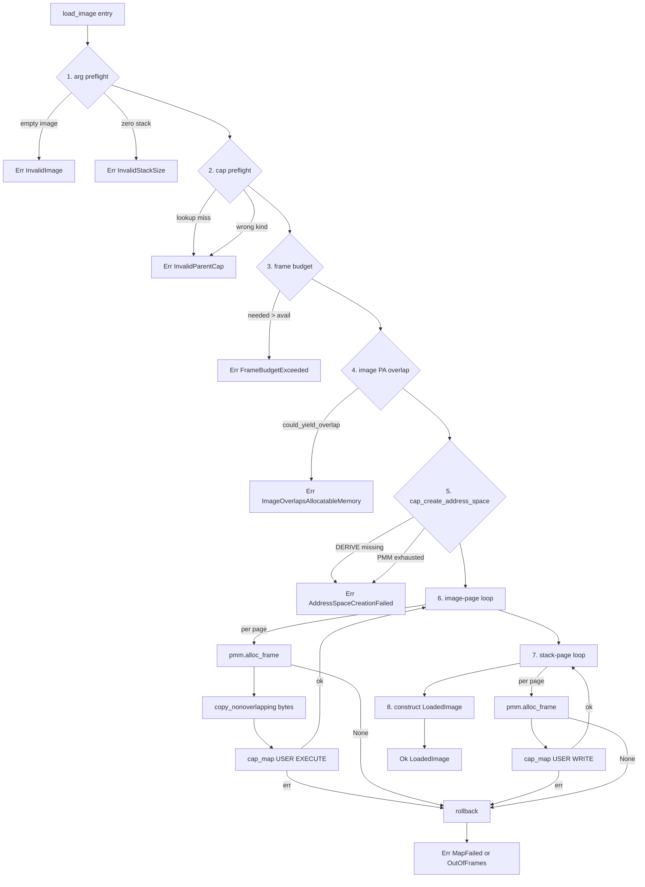
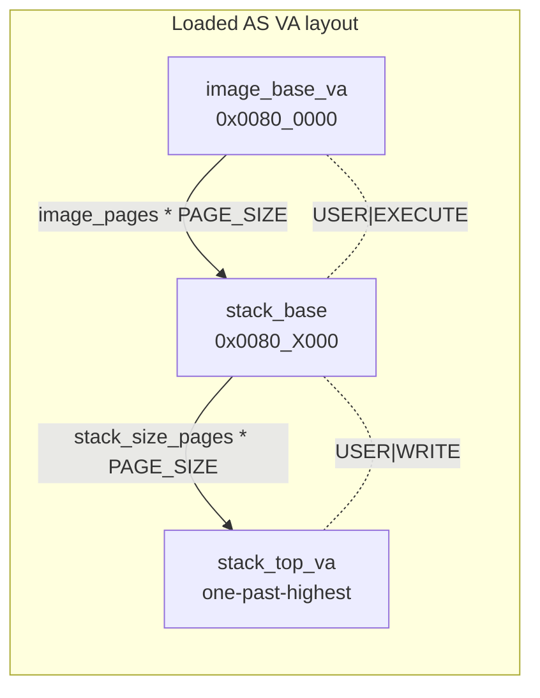

# Task loader

This chapter covers the **loader half** of Phase B's B4 milestone: how an embedded raw-flat userspace binary is turned into a populated address space. The complementary running half (`task_create_from_image` plus the syscall entry path) is documented separately when B5/B6 land.

It synthesises [ADR-0029](../decisions/0029-initial-userspace-image-format.md) (the raw-flat image format), [T-019](../analysis/tasks/phase-b/T-019-task-loader.md) (the loader implementation), [ADR-0028](../decisions/0028-address-space-data-structure.md) (the `AddressSpace<M>` kernel-object the loader writes mappings into), and [ADR-0035](../decisions/0035-physical-memory-manager.md) (the PMM the loader pulls frames from). When this document and an ADR disagree, the ADR is authoritative.

## Why a task-loader chapter

The loader is the first place where the four B-phase subsystems (PMM, MMU, capability table, address-space arena) compose into a single state machine. Every fallible step lives on a transaction boundary: succeed and the kernel state advances; fail and the function must unwind everything it has committed so far. The rollback contract is the load-bearing correctness property — without it, a misconfigured `image_base_va` or a frame-budget calculation bug would orphan PMM frames in an unreachable AS.

The loader is also the first runtime exerciser of three audit-log entries that previously had only host-test evidence: [UNSAFE-2026-0025](../audits/unsafe-log.md) (`QemuVirtMmu::map`'s page-table descriptor writes), [UNSAFE-2026-0026](../audits/unsafe-log.md) (the PMM's frame zero-fill via `core::ptr::write_bytes`), and [UNSAFE-2026-0027](../audits/unsafe-log.md) (the loader's own `core::ptr::copy_nonoverlapping` byte-copy site). The T-019 BSP wiring exercises all three on every boot.

## Scope boundary (load-complete, not B5/B6-runnable)

T-019 produces a [`LoadedImage`](../../kernel/src/obj/task_loader.rs) **descriptor**, not a `CapHandle{CapObject::Task(...)}` (a runnable task cap). The reasons are architectural, not implementation laziness:

- The current [`Task`](../../kernel/src/obj/task.rs) struct carries `id: u32` + `address_space_handle: AddressSpaceHandle` only — there is **no** PC/SP context register file on it, so `ContextSwitch::init_context` cannot consume a `LoadedImage` until B5 adds a per-task context surface.
- The loader's new address space contains **only** the image + stack mappings. No kernel mappings are installed — an EL1 exception taken while the userspace AS is active would translation-fault on the kernel-side vector fetch. The kernel-in-userspace-AS problem is the future [ADR-0033 high-half migration placeholder](../decisions/0027-kernel-virtual-memory-layout.md)'s responsibility, gated on B5 surfacing per-task `TTBR0_EL1` swap.
- The syscall entry path that lets a userspace task make its first kernel call is ADR-0030 / ADR-0031 work, also B5.

The `task_create_from_image` wrapper that turns a `LoadedImage` into a runnable task cap lands with B5 (syscall ABI per ADR-0030) and B6 (first userspace "hello") per [phase-b §B4 §Revision-notes](../roadmap/phases/phase-b.md#milestone-b4--task-loader).

## Pipeline (one §Simulation row at a time)

The loader is an eight-step state machine; each step matches one row of [T-019 §Approach §Simulation](../analysis/tasks/phase-b/T-019-task-loader.md#simulation). Steps 1–5 are preflights / state-uncommitted (no committed state on failure); steps 6–8 commit and require rollback machinery.



The preflight chain ([rows 1–4](../analysis/tasks/phase-b/T-019-task-loader.md#simulation)) is the discipline that keeps the rollback path bounded — by validating *before* `pmm.alloc_frame` is ever called, the loader guarantees that the "PMM allocated something we now can't undo" failure window is reduced to the structurally-rare mid-loop case. The frame-budget preflight (row 3) uses a **safe upper bound** (`1 + image_pages + stack_pages + 6` where the `1` is the root L0 frame `cap_create_address_space` allocates and the `6 = INTERMEDIATE_FRAME_BUDGET` is the worst case for v1's fresh-AS scenario: 3 intermediate page-table frames per contiguous VA range × 2 ranges for image + stack), not an exact calculation; the slack is bounded at ≤ 24 KiB per call. The image-PA-overlap preflight (row 4) discharges [UNSAFE-2026-0027](../audits/unsafe-log.md)'s "source and destination do not overlap" invariant at runtime by querying [`Pmm::could_yield_pa_overlapping`](../../kernel/src/mm/pmm.rs) with the image slice's PA range (correct under v1's identity-mapped kernel AS per ADR-0027 §Decision outcome (a)) — practically unreachable under correct BSP wiring (`.rodata`-resident images live in PMM-reserved memory by ADR-0035), but defensive against BSP misconfiguration.

## Rollback contract

Any failure from row 6 or row 7 triggers the rollback helper (`task_loader::rollback`). The contract is documented canonically in [T-019 §Approach §"Rollback contract (explicit)"](../analysis/tasks/phase-b/T-019-task-loader.md#rollback-contract-explicit); the summary below repeats the load-bearing shape:

- **Reverse install order.** Stack pages first (newest first), then image pages (newest first), to mirror the forward direction's allocation order.
- **Per page: `cap_unmap` + `pmm.free_frame`.** `cap_unmap` returns the orphaned `PhysFrame`; the helper passes it straight to `pmm.free_frame`. Errors from either are swallowed — the rollback path runs only after a primary failure; surfacing a secondary error would mask the first and provide no actionable information.
- **Failing iteration's leaf frame.** When `cap_map` fails mid-loop the just-allocated leaf frame was *not* moved into the AS; the forward path frees it directly via `pmm.free_frame` *before* invoking the helper. The helper only handles already-committed mappings.
- **Cap-side cleanup: `cap_drop`, not `cap_revoke`.** The AS cap is a leaf in the derivation tree by construction (the loader never derives from it), so `cap_drop` is the correct API: it `free_slot`s the leaf directly, requires only `!has_children` (satisfied), and is rights-agnostic. `cap_revoke(src)` would walk `src`'s *descendants* while leaving `src` itself valid, and also requires `CapRights::REVOKE` which `new_rights` may omit.

### v1 baseline leaks

Even with the right APIs, this is still cap-side and leaf-frame cleanup. Three resources **leak** in v1 on every rollback:

1. **The root L0 frame** `cap_create_address_space` allocated (step 5). `cap_drop` invalidates the cap but does not free the underlying frame.
2. **Intermediate L1/L2/L3 page-table frames** the BSP's `walk_or_alloc_table` allocated during `cap_map`. v1's `cap_unmap` removes the leaf descriptor but does not garbage-collect intermediates.
3. **The AS arena slot itself.** `cap_drop` does not call `destroy_address_space` on the arena slot.

This is the deliberate v1 trade-off recorded in [T-019 §"Why the leak is acceptable as a v1 baseline"](../analysis/tasks/phase-b/T-019-task-loader.md#rollback-contract-explicit): the rollback path is exercised only on PMM exhaustion (rare with 32 K frames and small image+stack budgets) or on a misconfigured `image_base_va` collision (a kernel-discipline bug, not a userspace-reachable path); the v1 demo does not retry-loop on failure. Full reclaim arrives with the future `MemoryRegionCap` + per-AS destroy ADR (B5+, slot reserved in the [B3 closure retro §Adjustments](../analysis/reviews/business-reviews/2026-05-14-B3-closure.md#adjustments)). Future-state retry loops (B5+) MUST be paired with the reclaim ADR before they land; T-019's `MapFailed`/`OutOfFrames` paths today are **fail-stop** at the caller level.

## Mapping flags

Per [T-019 §Acceptance criteria](../analysis/tasks/phase-b/T-019-task-loader.md#acceptance-criteria), the loader uses two fixed flag sets:

| Region | Flags | Rationale |
|--------|-------|-----------|
| Image | `MappingFlags::USER \| MappingFlags::EXECUTE` | Userspace must be able to fetch instructions; no `WRITE` so the kernel-image side of `.data` writes will fault until per-section flags land (deferred to ADR-0034). |
| Stack | `MappingFlags::USER \| MappingFlags::WRITE` | Userspace must be able to push/pop; no `EXECUTE` so a stack-based ROP-style attempt would fault (defence-in-depth, even though v1 has no userspace exploit surface). |

Per-section permissions (`.text` RX-only, `.rodata` R-only, `.data` RW-only, NX on non-`.text`) are deferred to the future ADR-0034 (placeholder; gated on B5+'s first attacker-observable execution context). Raw flat carries no section metadata, so the loader cannot discriminate today.

## Embedded image content (v1 placeholder)

T-019 ships with a hand-coded 8-byte aarch64 sequence:

```rust
// `mov w0, #42; ret` — sets w0 to 42 and returns.
// Word 0 LE = 0x52800540 → MOVZ Wd=w0, imm16=0x002a, hw=00, sf=0 (w-reg).
// Word 1 LE = 0xd65f03c0 → RET (Rn=x30 implicit).
static USERSPACE_IMAGE: &[u8] = &[0x40, 0x05, 0x80, 0x52, 0xc0, 0x03, 0x5f, 0xd6];
```

This is sufficient to exercise the loader's `cap_create_address_space` + `cap_map` + `LoadedImage` return path under host tests + the smoke trace. **The blob is not executed in B4.** B6's `userland/hello/` crate produces the real userspace binary per [ADR-0029 §Decision outcome (Build pipeline — B6)](../decisions/0029-initial-userspace-image-format.md).

## Userspace VA layout

T-019 uses `0x0080_0000` (8 MiB) as the userspace `image_base_va`. The choice is bounded by [ADR-0027 §Decision outcome (a)](../decisions/0027-kernel-virtual-memory-layout.md)'s `TTBR0_EL1` range (the full 48-bit userspace VA space) and pragmatically chosen for symmetry with the kernel image's PA layout (`linker.ld` places the kernel at PA `0x4008_0000` = 0.5 MiB into the kernel reservation; `0x0080_0000` mirrors this offset in userspace VA).

The stack region follows the image contiguously: `stack_base = image_base_va + image_pages * PAGE_SIZE`. `stack_top_va = stack_base + stack_size_pages * PAGE_SIZE` is **one-past-the-highest** mapped VA (half-open `[stack_base, stack_top_va)` convention). `sp = stack_top_va` at task-creation initialisation is correct because the first userspace push (e.g. `sp -= 16`) lands inside the mapped range — matches the AAPCS64 convention.



For T-019's v1 placeholder (8-byte image + 1-page stack), the layout resolves to:

```text
0x0080_0000  image base (entry)
0x0080_1000  stack base
0x0080_2000  stack_top_va (sp init)
```

The smoke trace's `tyrne: image loaded (entry = 0x800000; sp = 0x802000; image bytes 8; stack bytes 4096; AS cap = idx 1)` line is the runtime confirmation of this layout.

## Audit-log surface

| Entry | Operation | Status post-T-019 |
|-------|-----------|------------------|
| [UNSAFE-2026-0025](../audits/unsafe-log.md) | `QemuVirtMmu::map`/`unmap` page-table descriptor writes | **Lifted from `Pending QEMU smoke verification` via Amendment** — T-019's BSP smoke is the first runtime exerciser of the post-bootstrap `Mmu::map` path. |
| [UNSAFE-2026-0026](../audits/unsafe-log.md) | PMM frame zero-fill via `core::ptr::write_bytes` | **Lifted from `Pending QEMU smoke verification` via Amendment** — T-019's BSP smoke is the first runtime exerciser of `Pmm::alloc_frame`'s zero-fill block (the bootstrap AS was wrapped, not allocated). |
| [UNSAFE-2026-0027](../audits/unsafe-log.md) | Task-loader `core::ptr::copy_nonoverlapping` byte copy | **New entry** opened with T-019 commit 2. Lifts from `Pending QEMU smoke verification` to fully Active via Amendment on T-019 BSP wiring landing. |

The loader's `unsafe` surface is **exactly one block** in `kernel/src/obj/task_loader.rs::load_image`'s image-page loop. Everything else (preflights, rollback, stack-page loop's `cap_map`-only path, `LoadedImage` construction) is safe Rust.

## Test surface

T-019's host-test coverage in `kernel/src/obj/task_loader.rs::tests` pins **every row of the §Simulation table** plus the **rollback contract** plus the **enum-variant taxonomy**. The 24 tests decompose as:

- §Simulation row 1: `rejects_empty_image`, `rejects_zero_stack`.
- §Simulation row 2: `rejects_invalid_parent_cap_lookup`, `rejects_invalid_parent_cap_wrong_kind`.
- §Simulation row 3: `rejects_when_pmm_budget_exceeded`, `frame_budget_includes_root_plus_intermediates`.
- §Simulation row 4 (image-PA-overlap preflight): `rejects_when_image_overlaps_allocatable_memory`, `accepts_image_disjoint_from_pmm_extent`.
- §Simulation row 5 (DERIVE delegation + happy-path cap mint): `missing_derive_surfaces_via_address_space_creation_failed`, `returns_loaded_image_with_correct_metadata`.
- §Simulation rows 6–8 (happy path + per-region flag pins): `stack_top_va_is_one_past_highest_mapped`, `maps_image_pages_with_user_execute_flags`, `maps_stack_with_user_write_flags`, `tail_zeroing_on_partial_last_page`.
- §Rollback contract: `rolls_back_on_cap_map_failure_mid_image_loop`, `rolls_back_on_pmm_exhausted_mid_image_loop`, `rolls_back_on_cap_map_failure_mid_stack_loop`, `rolls_back_on_misaligned_image_base_va`, `rollback_helper_zero_pages_only_drops_cap`.
- Variant taxonomy: `loaded_image_struct_literal_round_trips_through_copy_and_eq`, `loaded_image_distinguishes_different_field_values`, `load_error_variants_pattern_match_exhaustively`, `load_error_variants_are_distinct`, `load_error_frame_budget_exceeded_fields_round_trip`.

The mid-loop-failure tests use two test-only injection mechanisms:

- A `FailingMapMmu` decorator (defined inline in the test module) wraps `FakeMmu` and fails the Nth `map` call deterministically — used to drive mid-image-loop and mid-stack-loop `cap_map` failures.
- [`Pmm::force_alloc_failure_after`](../../kernel/src/mm/pmm.rs), a `#[cfg(test)] pub(crate)` setter, schedules `alloc_frame` to start returning `None` after N successful calls — used to drive the `OutOfFrames` rollback path (structurally unreachable in v1 post-FrameBudgetExceeded preflight, but the defensive code in `load_image` has its own rollback shape that the test pins).

## Cross-references

- [ADR-0029 — Initial userspace image format](../decisions/0029-initial-userspace-image-format.md) — the raw-flat format decision this chapter implements.
- [T-019 — Task loader](../analysis/tasks/phase-b/T-019-task-loader.md) — the §Simulation table + acceptance criteria + rollback contract this chapter synthesises.
- [ADR-0028 — Address-space data structure](../decisions/0028-address-space-data-structure.md) — the `AddressSpace<M>` kernel object the loader writes mappings into.
- [ADR-0035 — Physical Memory Manager](../decisions/0035-physical-memory-manager.md) — the PMM the loader pulls frames from.
- [ADR-0027 — Kernel virtual memory layout](../decisions/0027-kernel-virtual-memory-layout.md) — `TTBR0_EL1` userspace VA range bounds.
- [`docs/architecture/memory-management.md` §"Address-space objects"](memory-management.md#address-space-objects) — the AS-object layer the loader composes on top of.
- [`docs/architecture/boot.md` §"Stages"](boot.md#stages) — the boot sequence the loader's smoke line slots into.
- [`docs/audits/unsafe-log.md`](../audits/unsafe-log.md) — UNSAFE-2026-0025 / 0026 / 0027 cover every `unsafe` block in the loader path.
